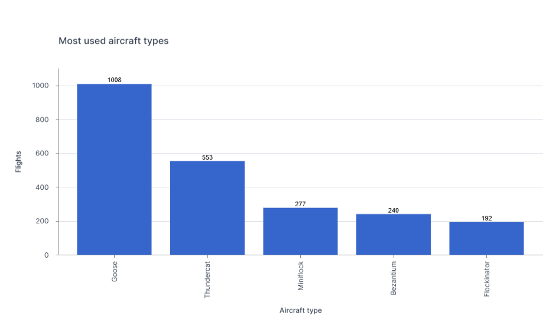
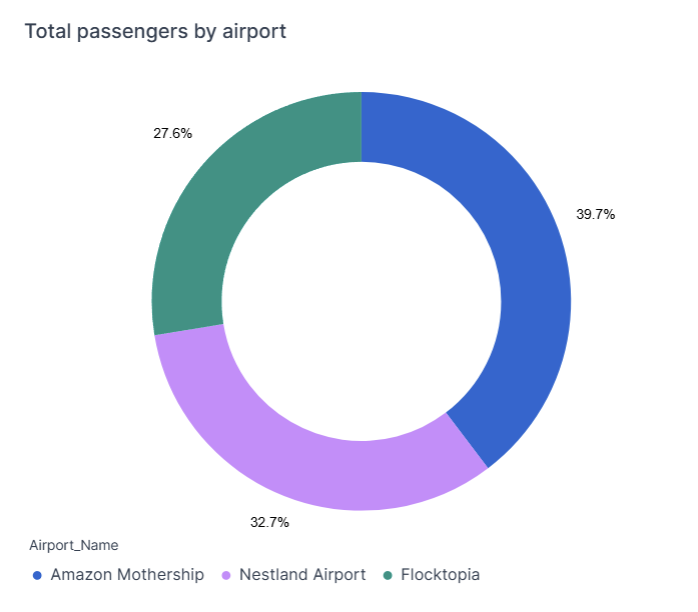
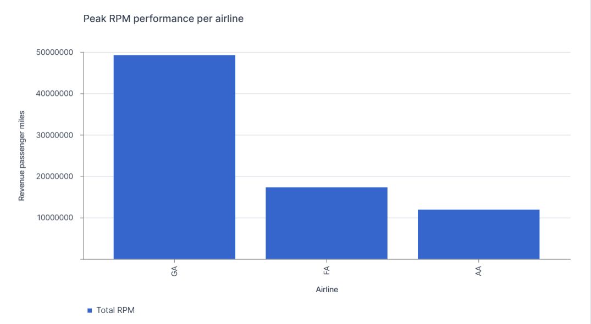
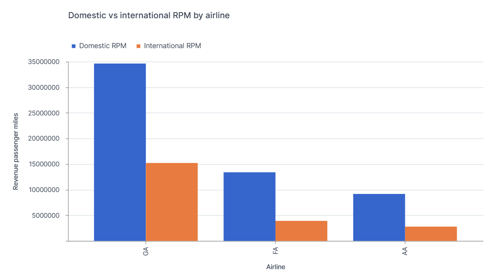
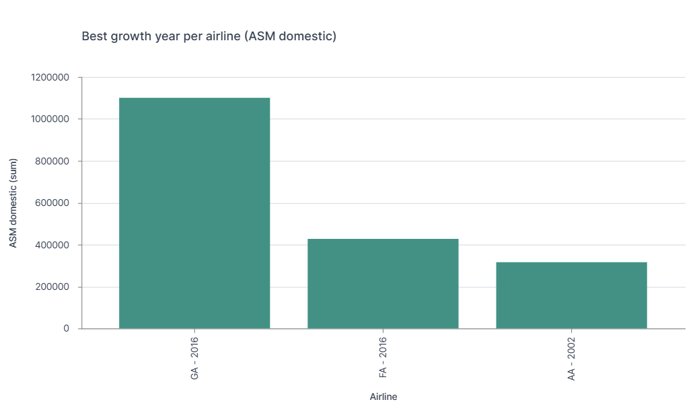
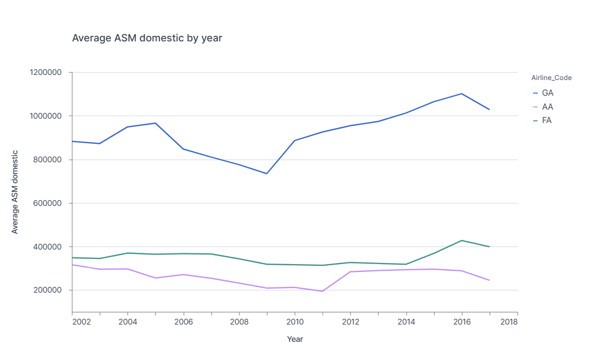

# ✈️ Aircraft Analytics – Data Analysis with Snowflake & Deepnote

Project carried out as part of the **Fullstack Data Analyst training at Jedha**.  
The objective: analyze airline activity using SQL in Snowflake and build clear, business-oriented visualizations in Deepnote.

---

## 🎯 Project Objectives

- Analyze aviation data using SQL  
- Extract business insights from airline operations  
- Answer key analytical questions about aircraft usage, airport traffic, and airline performance  
- Build clear visualizations to support decision-making  
- Publish a structured and professional project on GitHub  

---

## 🏗️ Technical Architecture

### Data Warehouse
- **Snowflake** → storage of raw and aggregated aviation data  

### Analysis
- **SQL** → data extraction and transformation  
- **Deepnote** → analysis and visualization  

### Environment
- **GitHub** → version control and project presentation  
- **VS Code** → development environment  

---

## 📊 Business Questions & Analysis

---

### ✈️ 1. Which aircraft is used the most?

| Number of Flights by Aircraft |
| :---: | 
|  |

### 🔍 Insight

- The **Goose aircraft** is the most frequently used  

### 💡 Interpretation

- Airlines rely on a limited number of aircraft types  
- Indicates strong operational optimization and cost efficiency  

---

### 🛫 2. Which airport transported the most passengers?

| Passenger Volume | 
| :---: | 
|  | 

### 🔍 Insight

- Passenger traffic is concentrated in a few major airports  

### 💡 Interpretation

- Strong **hub-and-spoke network model**  
- A small number of airports dominate total traffic  

---

### 📊 3. Best RPM Year per Airline

| Peak RPM Performance |
| :---: |
|  |

### 🔍 Insight

- Airline **GA** shows the highest overall performance  

---

| Domestic vs International RPM |
| :---: |
|  |

### 💡 Interpretation

- Domestic traffic dominates across all airlines  
- International traffic plays a secondary but strategic role  

---

### 📈 4. Best Growth Year (ASM) per Airline

| Peak Growth Year |
| :---: |
|  |

### 🔍 Insight

- **AA peaked in 2002**  
- **FA and GA peaked in 2016**

---

| Growth Trend Over Time |
| :---: |
|  |

### 💡 Interpretation

- Airlines follow different expansion strategies  
- GA shows the most consistent long-term growth  
- FA and GA experienced more recent expansion  

---

## 📊 Key Metrics

- **RPM (Revenue Passenger Miles)**  
- **ASM (Available Seat Miles)**  
- **Number of flights**  
- **Passenger estimates**  

---

## 📁 Repository Structure
- `/docs` → Project summary 
- `/sql` → SQL queries used for analysis  
- `/screenshots` → visualizations from Deepnote  
- `README.md` → project documentation
- `/gitignore`  

---

## 📈 Results

This project provides a clear overview of airline operations:

- Identification of most used aircraft  
- Detection of dominant airports  
- Analysis of airline performance (RPM)  
- Understanding of growth strategies (ASM)  

It demonstrates how structured SQL analysis can generate actionable business insights.

---

## ⚠️ Limitations

- Dataset is educational and simplified  
- Growth analysis is based only on **domestic ASM**  
- Passenger numbers are estimated based on aircraft capacity  
- Analysis remains descriptive (no predictive modeling)  

---

## 🚀 Future Improvements

- Add **Load Factor (RPM / ASM)**  
- Include **international ASM analysis**  
- Perform **time-series forecasting**  
- Integrate **geospatial analysis (GIS)**  
- Build a complete data pipeline (dbt / automation)  

---

## 👩‍💻 Author

**Saida Hadhraoui**  
Data Analyst | Urban Planning & Geospatial Data  

---

## ⭐ Project Value

This project demonstrates:

- SQL data analysis (Snowflake)  
- Data aggregation and transformation  
- Business-oriented insights  
- Data visualization  
- Structured project documentation  
